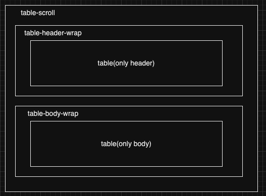
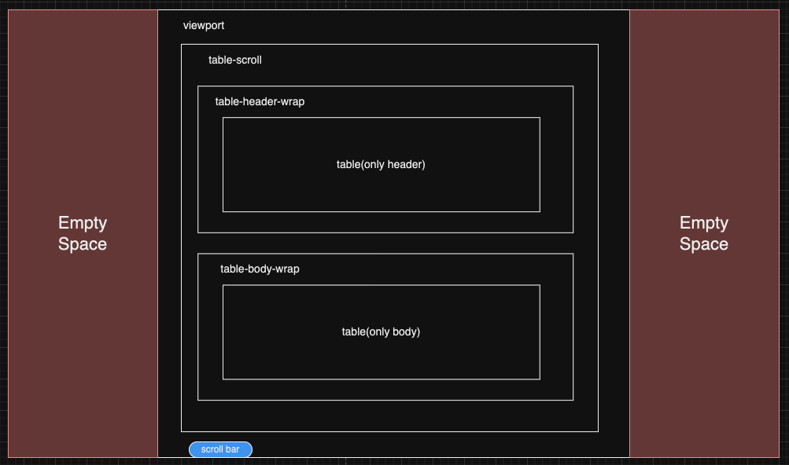

# vue3-virtual-column-table

## 개요
테이블이 브라우저의 스크롤에 따라 움직이는 것이 아닌, 테이블 내부 스크롤로 움직이도록 하는 컴포넌트다.  
테이블의 컬럼이 굉장히 많을 때 느려지는 현상을 회사에서 겪어 따로 정리용으로 만들었다(element-plus table-v1).

element-plus에서 테이블이 column이나 row 개수가 많아질 때 굉장히 느려지는 현상이 있었다.  
몇 개 이상을 그려내야 할 땐 브라우저가 죽는 현상도 경험하였기 때문이다.

## 본문

### 구조
예제용으로 정리한 테이블은,  
처음 몇 개의 컬럼은 width가 불규칙적으로 주어지고, 이후의 컬럼의 width는 모두 동일하게 주어지는 상황이다.

테이블은 colugroup으로 width를 컨트롤 하며, 테이블 header와 body쪽의 테이블은 따로 구성하여 스크롤을 따로 주어 테이블의 헤더와 바디를 분리하였다.    
이유인 즉슨, header를 고정시키기 위함이다.  
구조는 다음과 같다.

그래서,  
해당 예제를 구현할 때 스크롤에 따라 신경써야 할 건 다음들과 같다.
- colgroup
- header table
- body table

colgroup은 처음 몇 개의 컬럼은 width가 불규칙적이기 때문에, 스크롤 위치에 따라 좀 더 신경을 써야한다.  
colgrou은 header, body 테이블 둘 다 모두 들어간다.

### 구현
virtual scroll의 핵심은 viewport는 고정이고, 스크롤을 하면 스크롤 위치를 계산해서 데이터 인덱스를 계산한 다음 화면에 맞춰서 렌더링 하는 방식이다.  
즉, viewport의 width를 계산해놓고 스크롤에 이벤트 핸들러를 걸어 스크롤의 위치에 따라 필요한 데이터만 바꿔치기 하는 방식이다.

아래 이미지와 같이 viewport는 고정이고, scroll을 하면 스크롤 위치에 따라 데이터를 바꿔치기 한다.

총 4 영역을 스크롤함에 있어서 신경을 써야하고, 할 일은 다음과 같다.

1. 기본 column node width 세팅.
2. 해당 viewport의 전체 width 설정하기
    1. 처음 불규칙적인 width의 총합 구하기
    2. 추후 width가 동일한 컬럼의 총합 구하기
    3. 1번과 2번의 합을 viewport width로 설정하기 
3. mounted 시점에 화면에 표시할 데이터 목록 계산(인덱스 레인지 계산) 및 해당 계산 로직 scroll 이벤트 핸들러 추가.
    1. start index: scroll 위치 / eachRegularColumnSize
    2. step: vierport width / eachRegularColumnSize
    3. Array.prototype.slice(start index, step)
4. 총 4개의 영역에 적용해서 데이터 바꿔치기 적용.

### 예제 영상

https://github.com/novaray/vue3-virtual-column-table/assets/42734927/4cf191b0-1659-4d0a-b073-03f582ed3c40

